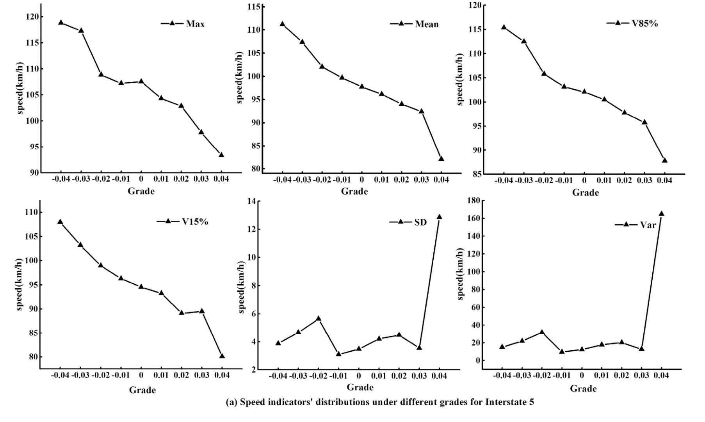
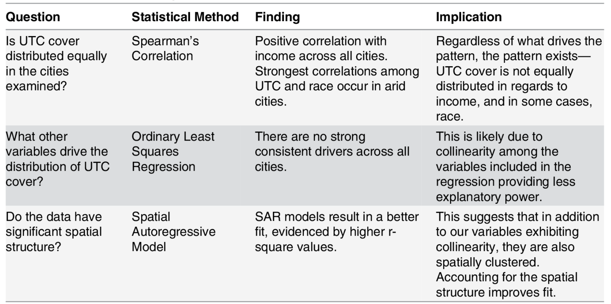
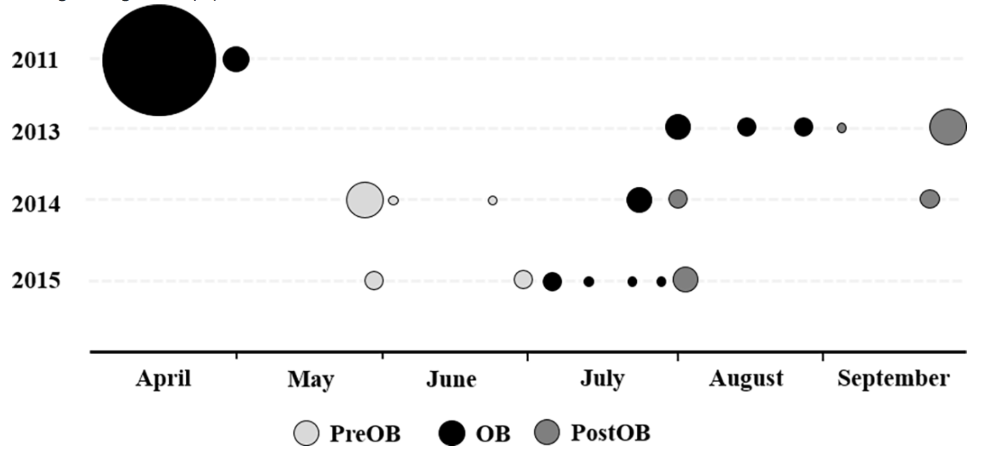

Part 1:
My review of em3932's citibike proposal is [here](https://github.com/evemarenghi/PUI2018_em3932/blob/master/HW4_em3932/CitibikeReview_nbc270.md)

Part 2: 
Statistical tests in the scientific literature. I collaborated with Ursula Kaczmarek in reviewing papers.

| **Statistical Analyses**	|  **IV(s)**  |  **IV type(s)** |  **DV(s)**  |  **DV type(s)**  |  **Control Var** | **Control Var type**  | **Question to be answered** | **_H0_** | **alpha** | **link to paper**| 
|:----------:|:----------|:------------|:-------------|:-------------|:------------|:------------- |:------------------|:----:|:-------:|:-------|
One-Tailed _t_-test	| 1: Roadway Grade| Continuous | 1: Speed | Continuous | 3: Weather, Traffic Flow, time| Categorical, Ordinal, Continuous | Is there significant difference among vehicle speed levels with neighboring roadway grades | A vehicles speed at a smaller grade will equal that of a neighboring larger grade | 0.05 | [Evaluating the impacts of grades on vehicular speeds on interstate highways](https://journals.plos.org/plosone/article?id=10.1371/journal.pone.0184142) 
Spearman's Correlation & Multivariate OLS Regression|3: Population % of race, Population % of ethnicity, Income|Continuous|1: Percentage of urban tree canopy in census block group|Continuous|1: Income| Continuous|Are their inequities associated with the distribution of urban tree cover amongst different communities of race, ethnicity, & income|Urban tree canopy is heavily distributed amongst areas of high income and weakly distributed amongst areas of low incomes|0.05 and 0.01|[Trees Grow on Money: Urban Tree Canopy Cover and Environmental Justice](https://journals.plos.org/plosone/article?id=10.1371/journal.pone.0122051)
Logistic Regression|7: Habitat, Microhabitat, Sex, Age Class, Hematological Parameters, Weight, Distance|Categorical, Continuous|1:Detection of Cause of Death (COD)|Binary|N/A|N/A|What are the predictors of mortality in _T. carolina carolina_|Predictor variable does not have an effect on the detection of COD |0.05|[Investigation of multiple mortality events in eastern box turtles (Terrapene carolina carolina)](https://journals.plos.org/plosone/article?id=10.1371/journal.pone.0195617#sec002)

Photos:

* T-Test

* Correlation/OLS Multivariate Regression

* Logistic Regression

Part 3: 
Reproducing post-prison employment study. Using z-test and chi-squared tests to reproduce results from in-prison program testing. I completed this on my own.

Part 4:
Citibike populations tests of correlation. Determining statistical significance of relationships between day & night Citibike riders. I worked on this on my own.
