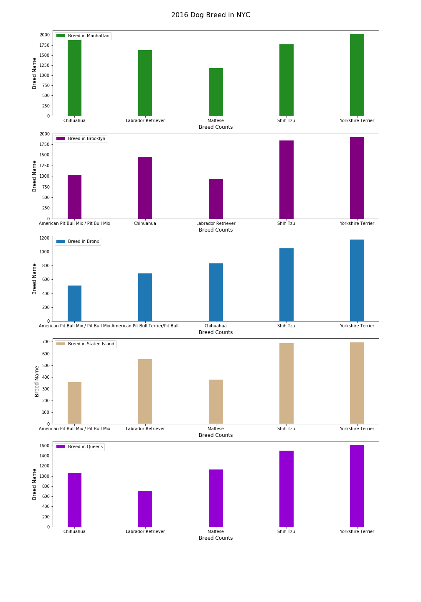

This is my (Nathan Caplan, nbc270) plot review for cl4855:

Clarity: The five plots successfully delivers the message about dog breeds in New York City. One thing of confusion was that the x-label and y-label appear to be in the others location. Regardless, I am a dog lover and I found the plots interesting and it provides data that explains why I constantly see Chihuahuas in Manhattan. 

Esthetic: The image is esthetically pleasing. Each graph has a different color for each borough, though perhaps Brooklyn and Queens should be two separate colors rather than different shades of purple. The figure is also unable to be seen in my window at once, requiring scrolling to see different parts of it. 

Honesty: The plot is reproducing the data. I followed the script to produce the plot and found that is was done properly by perform counts on all dog breeds for each burrough and taking the top five. Then it is plotted.

Improvements: As stated before, I would suggest making sure that each of the graphs had different colors. While most of them do, two are two shades of purple, which can be confusing to the viewer. The x and y labels need to be switched. To improve visualizing the figure without having to scroll That would help explain what the viewer is seeing. Lastly, I would suggest comments in the code to produce the figure. 

